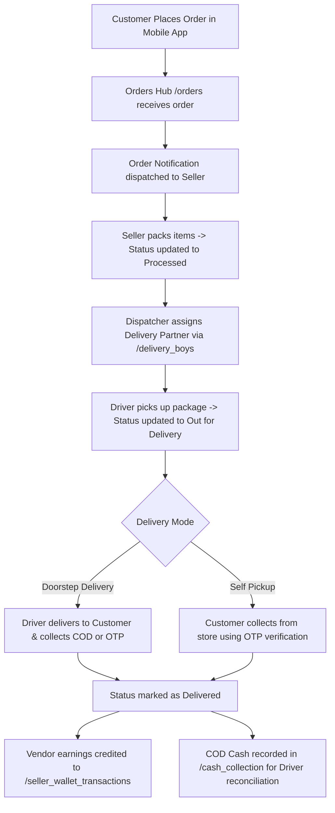

# eMarket Admin Panel — Detailed Documentation

Welcome to the comprehensive, page-by-page visual guide and operational manual for the **eMarket Admin Panel**. Every screen across the platform is documented here with high-resolution Retina screenshots captured directly from the live system, complete field breakdowns, step-by-step procedures, and real-world business use cases.

:::tip Multi-Module Architecture
eMarket is engineered as a unified multi-module commerce platform. Use the top bar **Module Selector** (e.g. *Grocery*, *Pharmacy*, *eCommerce*, *Food Delivery*) to switch operational context seamlessly. The sidebar navigation and functional features adapt dynamically based on the active module.
:::

---

## 1. Master System Dashboard (`/dashboard`)

The **Dashboard** is the first screen administrators see after authenticating into `http://127.0.0.1:8000/dashboard`. It serves as the live command center of your marketplace, aggregating real-time sales figures, order volumes, inventory alerts, and dispatch activity into an intuitive, high-level overview.

### 1.1 Header Controls & Quick Actions

The persistent top header bar provides universal platform controls accessible from any screen:

- **Sidebar Toggle (`☰`)**: Collapses or expands the left navigation drawer to maximize working space on laptops or wide displays.
- **Clear Cache Button**: Instantly clears cached application configurations, view templates, and translation dictionaries without requiring terminal SSH access.
- **Module Selector (`Grocery ▾`)**: The core switcher for your multi-store architecture. Selecting a module (e.g., Grocery, Pharmacy, eCommerce) filters the entire admin panel to show only data, orders, sellers, and products relevant to that sector.
- **Language Selector (`Eng ▾`)**: Switches the admin interface language on the fly (supports English, Arabic with RTL mirroring, Spanish, French, Hindi, and more).
- **Dark Mode Toggle (`☾`)**: Switches the entire admin panel between sleek Dark Mode and high-contrast Light Mode to reduce eye fatigue during long operational shifts.
- **Storefront Link (`🌐`)**: Quick link that opens your live customer-facing website in a new tab.
- **Notification Bell (`🔔`)**: Real-time alert tray notifying administrators of new customer orders, low stock warnings, seller registration requests, and driver cash limit breaches.
- **Admin Profile Menu (`Admin — SUPER ADMIN ▾`)**: Access to logged-in administrator credentials, profile picture, account security, and session logout.

---

### 1.2 At-a-Glance Real-Time Metrics

Four high-visibility status cards provide an instantaneous pulse of daily trading:

1. **Today Orders (Blue Icon)**: Total count of customer orders received since 12:00 AM today across all payment methods.
2. **Today Revenue (Green Icon)**: Net gross monetary value generated today, formatted in your chosen currency symbol (e.g., ₹, $, €).
3. **Today Return Product (Orange Icon)**: Number of return or replacement requests initiated by customers today requiring operational inspection.
4. **Today Cancelled (Red Icon)**: Number of orders cancelled today by customers or merchants, highlighting potential fulfillment issues or out-of-stock spikes.

---

### 1.3 Sales Overview Analytics Chart

The large central visualization card renders a comparative bar chart tracking sales velocity over time:
- **Orders vs. Revenue**: Compares raw volume of orders against total monetary turnover.
- **Period Filter Dropdown**: Toggle between:
  - **Yearly View**: 12-month rolling macro performance to identify seasonal peaks.
  - **Monthly View**: Day-by-day velocity across the current calendar month.
  - **Weekly View**: Hourly or daily trends across the last 7 days to optimize courier staffing.

---

### 1.4 Daily Administrative Routine: Step-by-Step

Follow this recommended 5-minute morning routine to maintain peak marketplace efficiency:

1. **Log in to Dashboard**: Open `http://127.0.0.1:8000/dashboard` and verify the active **Module** (e.g., Grocery).
2. **Review Today's KPI Cards**: Check **Today Orders** and **Today Revenue**. If **Today Cancelled** or **Today Return Product** shows an abnormal spike, immediately click into the Orders section to diagnose the issue.
3. **Check Notifications Tray**: Click the **Notification Bell** to review pending seller applications or driver cash remittal alerts.
4. **Inspect the Sales Overview Chart**: Compare current-week revenue against the previous week to gauge whether ongoing promotional campaigns are performing as expected.
5. **Transition to Fulfillment**: Click **Orders** in the left sidebar to begin assigning newly received orders to available delivery partners.

---

### 1.5 Real-World Dashboard Use Cases

- **Morning Store Opening Checklist**: Before dispatch hubs open at 8:00 AM, store managers review overnight orders and verify that delivery partners have reported on duty.
- **Monitoring Flash Sale Spikes**: During a weekend promotional campaign, marketing teams monitor the live revenue counter to measure real-time ROI on push notifications and social media ads.
- **Fraud & Out-of-Stock Detection**: A sudden surge in **Today Cancelled** alerts the team that a popular vendor forgot to mark out-of-stock items, allowing administrators to intervene before more shoppers are disappointed.

---

## 2. Multi-Module Platform Architecture (`/modules`)

eMarket supports multiple distinct business models inside a single software installation. Each module functions as an independent business vertical with its own categories, seller rules, and delivery constraints.

### Supported Industry Verticals
- **Grocery & Supermarket**: Fast-moving consumer goods, scheduled morning/evening delivery time slots, weight-based inventory (kg, grams).
- **Pharmacy & Healthcare**: Prescription validation requirements, licensed pharmacist verification, temperature-sensitive cold chain items.
- **eCommerce & Retail**: Standard courier parcel shipping, multi-variant sizing (clothing, electronics), nationwide shipping.
- **Food Delivery**: Restaurant menus, instant courier dispatch, custom item addons (toppings, crusts, spice levels).

---

## 3. Platform Navigation Directory

Explore the dedicated detailed documentation sections below for step-by-step instructions and real-world workflows across each operational module:

| Documentation Section | Topics Covered | Link |
| :--- | :--- | :--- |
| **Order Management & Fulfillment** | Doorstep orders, click-and-collect self-pickup, status lifecycle, PDF invoice generation. | [Go to Orders Guide](./orders) |
| **Catalog & Product Management** | Categories hierarchy, product wizard, seller approvals, media manager, bulk CSV tools, taxes, stock. | [Go to Catalog Guide](./catalog) |
| **Seller & Vendor Management** | Merchant onboarding, identity KYC, store commissions, seller wallet ledgers, vendor policies. | [Go to Sellers Guide](./sellers) |
| **Delivery Operations & Fleet** | Delivery partner roster, time slot capacity, COD cash collection, settlements, salary models. | [Go to Delivery Guide](./delivery) |
| **Marketing & Promotions** | Home sliders, promotional deals, app popups, promo discount codes, featured product showcases. | [Go to Marketing Guide](./promotions) |
| **Customer & Financial Operations** | Customer directory, wishlists, digital wallets, payment gateway logs, returns & withdrawals. | [Go to Finance Guide](./customer-finance) |
| **Communications & Messaging** | Push notification broadcasts, transactional trigger templates, emails, SMS gateway settings. | [Go to Communications Guide](./communications) |
| **Platform & Store Settings** | Core store configuration, payment processors, additional fees, Firebase, SEO metadata. | [Go to Settings Guide](./settings) |
| **Localization & Zones** | Multi-language translation dictionaries, RTL support, countries, deliverable cities & pincodes. | [Go to Localization Guide](./localization) |
| **Web Presence, Blogs & Plans** | Public website branding, social media links, content marketing blogs, vendor subscription tiers. | [Go to Content & Web Guide](./content-blogs) |
| **Reports & Business Intelligence** | Gross sales analytics, SKU turnover rates, platform commission earnings, financial CSV exports. | [Go to Reports Guide](./reports) |
| **Administration, Roles & FAQs** | Admin user accounts, granular RBAC permission matrix, customer FAQs, system upgrades. | [Go to Admin & FAQs Guide](./admin-faqs) |

---

## 4. End-to-End Order Lifecycle Flow

The diagram below illustrates how each component of the eMarket admin suite collaborates throughout a customer transaction:

